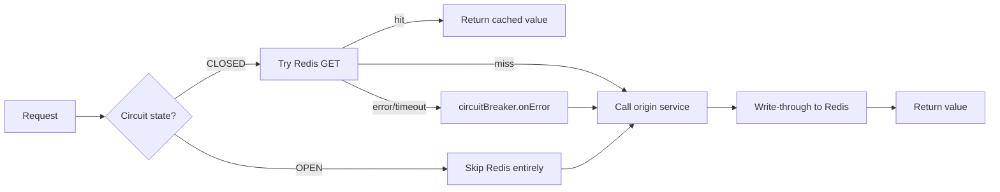
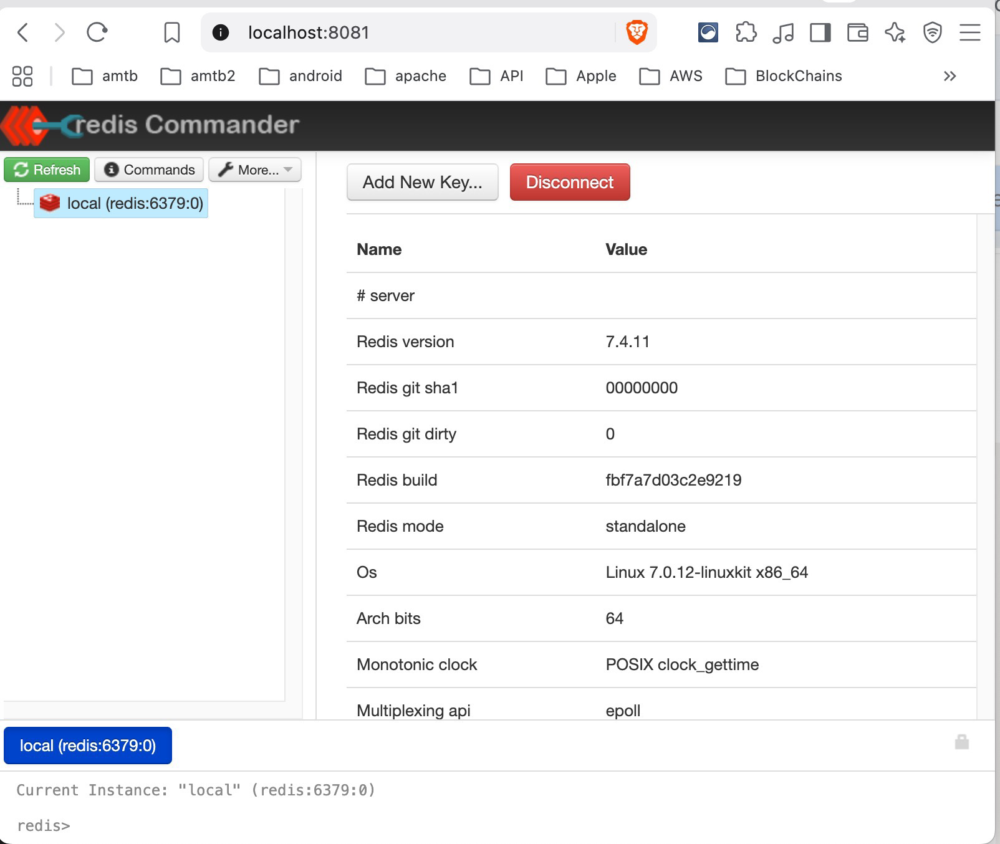
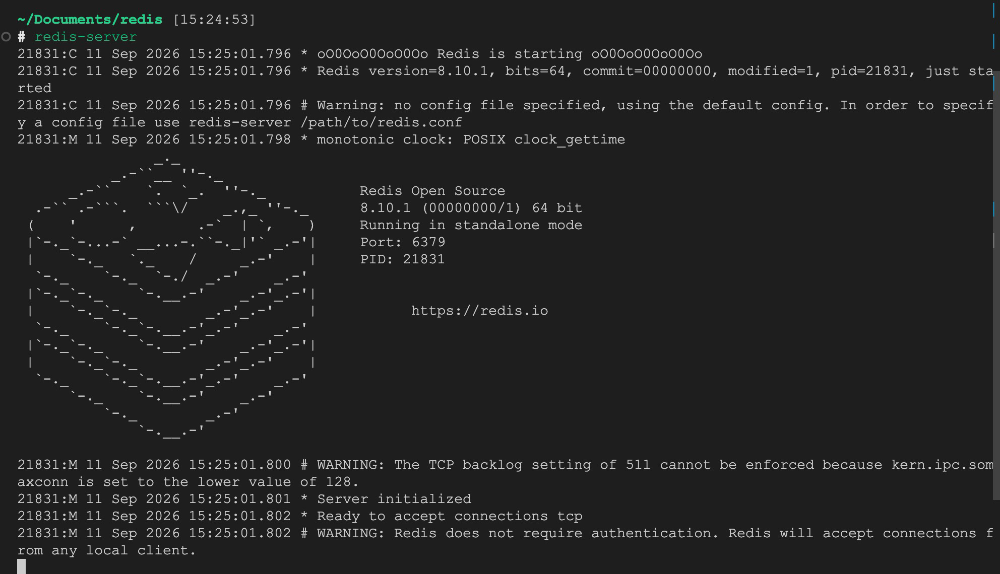
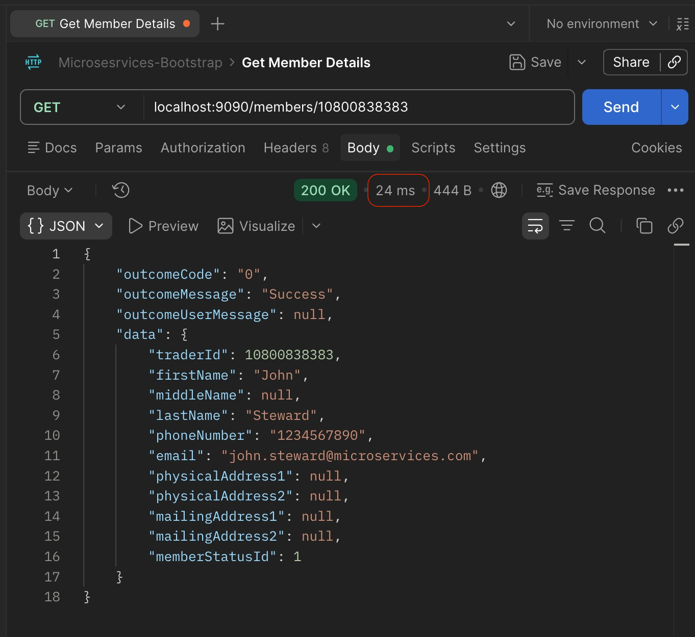
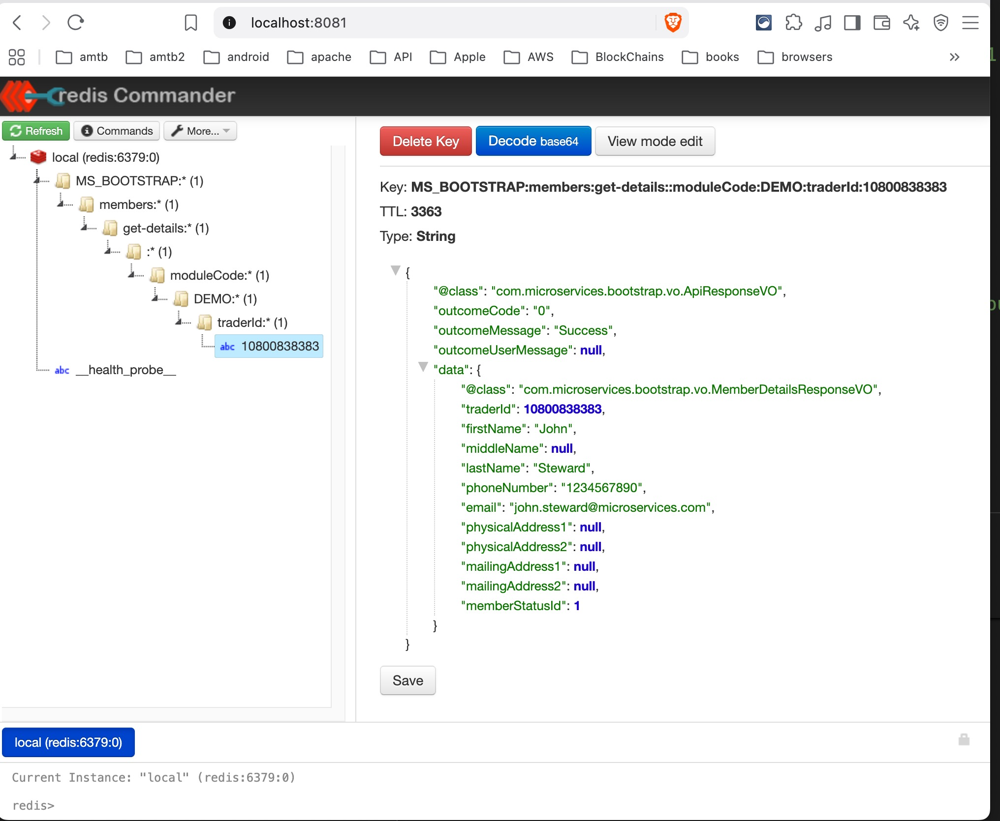

# Redis Integration with Circuit Breaker

While Spring Boot provides @Cacheable out of the box, its default implementation relies on an in-memory cache limited to a single JVM instance. To support a clustered deployment of multiple Spring Boot applications and prevent cache inconsistency, we use Redis as a centralised, distributed cache manager. As a result, any service method annotated with `@Cacheable` checks Redis for a cached value before falling through to its underlying logic.

This project is a Spring Boot (WebFlux) reference implementation of Redis caching that fails safe. If Redis is slow, unreachable, or returns garbage, the application keeps serving traffic from the origin service instead of timing out or throwing error — protected by a [Resilience4j](https://resilience4j.readme.io/) circuit breaker.

The complete implementation is available on the [`redis-integration`](https://github.com/sam888/microservices-bootstrap/tree/redis-integration) branch of the `microservices-bootstrap` project.

---
## Motivation

Consider an API that experiences a daily traffic burst — up to 5,000 requests within a 5-minute window during lunch hour, sustained over 30–60 minutes. Traffic at this volume puts sustained pressure on the database, increases API latency, and can trigger cascading failures across dependent services.

A caching layer like Redis absorbs this load by serving cached results directly, within the configured TTL(time to live), instead of hitting the backend database on every request.

**The mechanism:** When the database is overwhelmed by a traffic burst like this, it doesn't fail in isolation:

1. **Database slows down** — queries that normally take 100~400ms now can take up to 10 seconds under saturation!
2. **Requests pile up** waiting on those slow queries in API, holding threads and connections longer than usual
3. **The API's own resources exhaust** — connection pool runs dry, thread pool fills up, memory climbs from queued requests.
4. **The API becomes slow or unresponsive** — not because its code is broken, but because it's starved waiting on the database.
5. **Callers of the API** experience the same problem one level up — their requests start timing out or queuing.
6. **This repeats outward**, through every service that depends on the one before it!

Increasing the maximum number of active datasource connections, or scaling the API horizontally (e.g., using replicas in a Kubernetes deployment), can raise the ceiling before this problem occurs. But both are mitigations that add capacity — they don't reduce the underlying load. A caching layer like Redis addresses the cause directly, by absorbing repeat requests before they ever reach the database.

---
## Why Use a Circuit Breaker

Caching is easy when Redis is healthy. It's the *unhealthy* path most implementations get wrong — a slow or down Redis instance can end up being slower than having no cache at all, because every request still pays the connection/timeout cost before falling back.

This project treats Redis as **best-effort**, never a hard dependency:

- No response ever fails because Redis is down.
- Every Redis error is fed into a circuit breaker so the app *stops trying* to access Redis once Redis is clearly unhealthy, instead of paying a timeout on every single request.
- The `@Cacheable` path reports into that breaker, and a scheduled health probe keeps its state accurate even between requests — so there's a live source of truth for "is Redis healthy right now" that doesn't depend on traffic volume.

## How it works



**State transitions** (`resilience4j.circuitbreaker.instances.redis`):

| State | Behaviour |
|---|---|
| `CLOSED` | Normal operation — every cacheable call attempts Redis first. |
| `OPEN` | Redis is skipped entirely; requests go straight to the origin service. Trips when ≥ 50% of the last 10 calls fail. |
| `HALF_OPEN` | After a 30s cooldown, a small number of probe calls are allowed through. All must succeed to close the circuit again; any failure re-opens it. |

The breaker is driven from **two independent sources**, so it reflects reality even when there's no live traffic to trigger it:

1. **`RedisCacheErrorHandler`** — implements Spring's `CacheErrorHandler`. Every `@Cacheable` GET/PUT/EVICT/CLEAR failure calls `circuitBreaker.onError(...)` and swallows the exception, so a Redis outage never propagates to the caller.
2. `RedisHealthProbe` — a `@Scheduled` job (every 5s) that does a real `SET`/`GET` round trip through the same `RedisTemplate` and `GenericJackson2JsonRedisSerializer` configured in `RedisCacheConfig`, then calls `onSuccess()`/`onError()` — the missing counterpart to `RedisCacheErrorHandler`, which only ever reports failures. A plain `PING` (what Spring Boot Actuator's default `GET /actuator/health/redis` check does) only proves TCP connectivity — it can't catch a broken serialization pipeline, such as a misconfigured `ObjectMapper` after a bad deploy. This probe exercises that same serialization path, so a global breakage of that kind shows up even with zero real traffic. It's worth noting the probe uses its own dedicated key, so it verifies the pipeline is healthy in general — it doesn't retroactively detect an already-poisoned individual cache entry from a different key; that case is still caught by `RedisCacheErrorHandler` the moment real traffic hits it.

---
## Code and configuration for Redis and Circuit Breaker

### Key components

| Class                    | Responsibility                                                                                                                                         |
| ------------------------ | ------------------------------------------------------------------------------------------------------------------------------------------------------ |
| `RedisCacheConfig`       | Wires the Lettuce connection factory, JSON serializer, `RedisTemplate` / `ReactiveRedisTemplate`, and the `CacheManager` with per-cache TTL overrides. |
| `RedisCacheErrorHandler` | Swallows `@Cacheable` errors and reports them to the `redis` circuit breaker.                                                                          |
| `RedisHealthProbe`       | Active heartbeat that keeps the breaker's state accurate between requests.                                                                             |
| `CacheNames`             | Central registry of cache name constants shared between `@Cacheable` annotations and `RedisCacheConfig`.                                               |
### Configuration

```yaml
spring:
  data:
    redis:
      host: ${REDIS_HOST:localhost}
      port: ${REDIS_PORT:6379}
      connect-timeout: 1000ms
      lettuce:
        pool:
          max-active: 64
          max-idle: 16
          min-idle: 8
          max-wait: 1000ms
    cache:
      type: redis
      redis:
        time-to-live: 180000   # 3 min default TTL
        cache-null-values: false

resilience4j:
  circuitbreaker:
    instances:
      redis:
        sliding-window-type: COUNT_BASED
        sliding-window-size: 10
        failure-rate-threshold: 50
        minimum-number-of-calls: 5
        wait-duration-in-open-state: 30s
        permitted-number-of-calls-in-half-open-state: 3
        automatic-transition-from-open-to-half-open-enabled: true
```

Note the Redis command timeout is set separately, in code (`RedisCacheConfig`), to **100ms** — deliberately aggressive, since that timeout only ever fires once the circuit is already open or half-open probing, not during normal healthy operation.

Note `permitted-number-of-calls-in-half-open-state: 3` under the `redis` circuit breaker instance in `application.yml`.

When the circuit enters the `HALF_OPEN` state, Resilience4j permits up to 3 trial requests — such as calls to `MemberService.getMemberDetails(...)` or `RedisHealthProbe.probe()`—to execute against Redis. If all 3 probe calls succeed, the circuit transitions back to `CLOSED`.

If Redis has recovered during this trial period, cache lookups will succeed immediately for those probe requests; you do not need to wait for the circuit to fully transition to `CLOSED` for caching to resume.

### Example usage

```java
@Slf4j
@Service
public class MemberService {

   public static final String CIRCUIT_BREAKER_NAME = "redis";

   @CircuitBreaker(name = CIRCUIT_BREAKER_NAME, fallbackMethod = "getMemberDetailsFallback")
   @Cacheable(
           value = CacheNames.GET_MEMBER_DETAILS,
           key = "'moduleCode:' + #moduleCode + ':traderId:' + #traderId"
   )
   public Mono<ApiResponseVO<MemberDetailsResponseVO>> getMemberDetails(String moduleCode, Long traderId) {
      return getMemberDetailsByDatabase(moduleCode, traderId);
   }

   /**
    * @CircuitBreaker fallback. Resilience4j resolves this by name and parameter
    * types at runtime, so the signature must be the original method's parameters
    * plus a trailing Throwable — it will not match the plain 2-arg method above.
    * Triggered either when the circuit is OPEN (fails fast, skipping Redis and the
    * database call entirely) or when the underlying call throws — e.g. a Redis
    * connectivity failure that occurs while the circuit is still CLOSED, before
    * enough failures have accumulated to trip it.
    */
   public Mono<ApiResponseVO<MemberDetailsResponseVO>> getMemberDetailsFallback(
           String moduleCode, Long traderId, Throwable throwable) {
      log.warn("Circuit breaker fallback triggered for moduleCode={} traderId={} — {}",
              moduleCode, traderId, throwable.toString());
      return getMemberDetailsByDatabase(moduleCode, traderId);
   }
   
   /**
    * Core logic, shared by getMemberDetails() and getMemberDetailsFallback(). Extracted
    * so neither path duplicates business logic — the only difference is whether the
    * result gets cached by @Cacheable on the way back out.
    */
   public Mono<ApiResponseVO<MemberDetailsResponseVO>> getMemberDetailsByDatabase(String moduleCode, Long traderId) {
      // ...business logic...
   }
}
```

`@CircuitBreaker` wraps outermost around `@Cacheable` in this project (see [Configuration](#configuration) — `circuit-breaker-aspect-order: -100`), so it sees the final result of the entire caching layer underneath it: a cache hit, a cache miss that falls through to the database, or an error from either.
* When the circuit is `OPEN`, it can fail fast and calls `getMemberDetailsFallback` directly — `@Cacheable` is never reached, and no Redis call is attempted.
* When the circuit is `CLOSED` but a Redis call still fails (the gap between "Redis just died" and "the breaker has tripped"), the same fallback catches that error too, since it's wrapping the whole call.

One dependency worth knowing about: `@CircuitBreaker` (and Resilience4j's other annotations) are AspectJ-style aspects that require `spring-boot-starter-aop` on the classpath to actually intercept anything. Without it, the annotation is silently inert — no error, no fallback, just a plain, unprotected method call — which is a real, easy trap to fall into.

Without @CircuitBreaker, if Redis goes down, the API will return the error below FOREVER!
```java
{
    "timestamp": "2026-09-11T04:59:39.228+00:00",
    "path": "/members/10800838383",
    "status": 500,
    "error": "Internal Server Error",
    "requestId": "c6bbee6e-5",
    "message": "Connection reset"
}
```

You may also notice that each use of `@CircuitBreaker(...)` requires an extra fallback method. While this may seem inconvenient, the `resilience benefits` far **outweighs** the drawback.

### Reactive Return Type Support (`Mono`/`Flux`)

As of [Spring Framework 6.1](https://docs.spring.io/spring-framework/reference/integration/cache/annotations.html), `@Cacheable`, `@CachePut`, and `@CacheEvict` all take reactive return types into account — Spring awaits the `Mono`/`Flux`, caches the emitted value once it's available, and re-wraps it for return. This project runs Spring Boot 3.5.14, which pulls in Spring Framework 6.2.x — well past that 6.1 baseline. So `@Cacheable` on a `Mono<T>`-returning method, exactly like `MemberService.getMemberDetails`, is fully supported and works correctly, with no special handling required.
### Understanding `wait-duration-in-open-state`

`wait-duration-in-open-state` controls how long the circuit stays`OPEN` — failing fast, bypassing Redis entirely — before it allows a handful of test calls through to check if Redis has recovered.

**Default:** 60 seconds. Configurable per breaker in `application.yml`:

```yaml
resilience4j:
  circuitbreaker:
    instances:
      redis:
        wait-duration-in-open-state: 30s   # or 30000ms
```

### How it works

```
[Redis crashes]
       │
       ▼
1. Requests fail ➔ failure rate exceeds threshold ➔ circuit OPENS
       │
       ▼
2. wait-duration-in-open-state clock starts (e.g. 30s, per this project's config)
   └─ While OPEN: requests bypass Redis entirely and go straight to the
      origin service — zero added latency, zero retries against a dead Redis
       │
       ▼
3. Timer expires ➔ circuit enters HALF_OPEN
       │
       ▼
4. A limited number of test calls are allowed through:
   ├─ Redis still down  ➔ circuit re-opens, timer restarts
   └─ Redis has recovered ➔ circuit CLOSES, normal traffic resumes
```

The key thing to understand: **this timer is a fixed clock, not a health check.** It doesn't matter how many times Redis fails or succeeds while `OPEN` — nothing shortens or extends the wait. The only way out of `OPEN` is time.

### This project's twist: `RedisHealthProbe` doesn't change that timer

It might look like `RedisHealthProbe` — which probes Redis with a real `SET`/`GET` every 5 seconds, independent of request traffic — would let the circuit recover faster than the timer allows. It doesn't. Resilience4j's own tests confirm the `OPEN → HALF_OPEN` transition happens purely because the wait duration elapsed, regardless of what any `onSuccess()`/`onError()` call reports in the meantime.

So `RedisHealthProbe` and `wait-duration-in-open-state` solve two different problems, not one:

|                               | Job                                                                                                                                                                                                                    |
| ----------------------------- | ---------------------------------------------------------------------------------------------------------------------------------------------------------------------------------------------------------------------- |
| `wait-duration-in-open-state` | Decides **when** the circuit is allowed to try Redis again.                                                                                                                                                            |
| `RedisHealthProbe`            | Keeps the breaker's failure-rate data **accurate** between requests, so the failure-threshold math (`CLOSED → OPEN`) reflects Redis's real state even during quiet traffic — it doesn't touch the `OPEN` timer itself. |

---
## Running Redis

This project needs a Redis instance reachable at `localhost:6379` (or whatever `REDIS_HOST`/`REDIS_PORT` you configure — see [Configuration](#configuration)). Pick whichever of these fits your setup.

**Option A: Docker Compose (platform-neutral, recommended)**

Works the same on macOS, Linux, and Windows (via Docker Desktop/WSL2) — no local Redis install needed. The docker-compose.yml file has
```yml
services:
  redis:
    image: redis:7-alpine
    container_name: redis
    ports:
      - "6379:6379"
    volumes:
      - redis-data:/data
    command: redis-server --save 60 1   # persist to disk every 60s if at least 1 key changed

  redis-commander:
    image: rediscommander/redis-commander:latest
    container_name: redis-commander
    environment:
      - REDIS_HOSTS=local:redis:6379    # ← this is what API connects to
    ports:
      - "8081:8081"                     # ← this is a browser UI, unrelated to your API
    depends_on:
      - redis

volumes:
  redis-data:
```

Usage:
```bash
docker compose up -d          # starts both Redis and the UI
docker compose down           # stops and removes both containers
docker compose down -v        # also wipes the persisted data volume
```

Local Redis Commander at port 8081 in browser looks like:

<a href="images/redis-commander-1.png">

</a>

**Option B: Docker (platform-neutral\)**

```bash
# Start Redis, exposed on the default port
docker run --rm -d --name redis -p 6379:6379 redis:7-alpine

# Open an interactive redis-cli shell inside the running container
docker exec -it redis redis-cli

# Inside redis-cli — list all keys currently cached
keys "*"

# Stop and remove the container
docker stop redis
```
`--rm` means the container (and any cached data in it) disappears once stopped. Drop `--rm` and add `-v redis-data:/data` if you want data to persist across restarts.

**Option C: Native install (macOS via Homebrew)**

```bash
brew install redis

# Run as a background service (survives terminal close, restarts on login)
brew services start redis
brew services stop redis

# Or run interactively in the foreground, useful for watching logs live
redis-server
```

<a href="images/redis-server.png">

</a>

**Note:** `redis-server` run this way can keep running in the background even after `Ctrl+C` — if that happens, stop it explicitly with:

```bash
redis-cli shutdown
```

Either way, check what's currently cached with:
```bash
redis-cli keys "*"
```


---

## Testing

1. **Start the Infrastructure:** Launch both Redis and `microservices-bootstrap`. Obtain a JWT token via `POST http://localhost:9090` (refer to the [microservices-bootstrap README](#https://github.com/sam888/microservices-bootstrap) for instructions).

2. **Verify Initial Response (Cache Miss):** Call `GET http://localhost:9090/members/10800838383`. The initial request will take at least **500ms** to return mock data. This delay is introduced artificially in `MemberService.getMemberDetailsByDatabase(...)` to simulate database processing time:

   ```java
   // Simulate taking 500ms to process
   return Mono.just(new ApiResponseVO<>(responseVO))
              .delayElement(Duration.ofMillis(500));
   ```

2. **Verify Caching (Cache Hit):** Execute the same `GET` request a second time. The response time will drop to **< 30ms**, confirming that the Redis cache is working as expected. The circuit is now CLOSED.

<a href="images/postman.png">

</a>


4. **Verify Resilience (Redis Failure):** Stop the Redis server and re-send the request. Although response times will degrade due to Redis connection timeouts, the API remains functional and returns data, thanks to the Resilience4j Circuit Breaker. The circuit is now OPEN.

5. Start up Redis again then re-send the request, first hit will save data to cache, resending request will see improved performance again. Circuit is closed again.

Now, if Redis is run by the `docker-compose.yml` file above and request data is cached, we can view the cached data using the web-based management tool **Redis Commander** by visiting `http://localhost:8081` in a browser.

In Redis Commander, double-click **`MS_BOOTSTRAP: (1)`** in the left-hand panel to expand the key hierarchy. Continue expanding the nodes until reaching the leaf node **`10800838383`**, then click **`View mode edit`** button in right-hand panel to view the actual cached data, as shown in the screenshot below. Once clicked, `View mode edit` button will change label to `View mode edit`.

<a href="images/redis-commander-2.png">

</a>

---
## Tech stack

- Java 17, Spring Boot 3.5, Spring WebFlux
- Redis (targeting Redis 7.x — see [Running Redis](#running-redis))
- Spring Data Redis (Lettuce client)
- Resilience4j (`resilience4j-spring-boot3`, `resilience4j-reactor`)
- Spring Boot Actuator (health/metrics for the breaker and Redis)

---
## Design notes

- **Lazy connection** (`setValidateConnection(false)`) — the app won't fail to start just because Redis is briefly unavailable; Lettuce connects on first real use and auto-reconnects transparently.
- **Never cache nulls** — a null is treated as "go ask the origin again," not a cached absence.
- **Transaction-aware `CacheManager`** — a `@Transactional` method that rolls back won't leave a stale cache entry behind.
- **Shared serializer** across `RedisTemplate`, `ReactiveRedisTemplate`, and the `CacheManager`, so every write path produces keys/values every read path can understand.

---
## Production Deployment

A note on production deployment: this project runs Redis as a self-managed dependency, which is appropriate for a developer/demo environment. For a real production deployment on AWS, consider a managed offering like ElastiCache instead of self-hosting Redis on EKS. It typically costs more per node than self-hosting, but that premium buys you automated failover, patching, and backups — work your team would otherwise carry themselves. Whether that trade-off is worth it (and which option is actually cheaper) depends heavily on scale, traffic pattern, and reserved-instance pricing — worth a real cost comparison for your specific workload rather than assuming either direction by default.

Consider Valkey over Redis OSS. In March 2024, Redis Ltd. changed Redis's license from the permissive BSD-3-Clause to the more restrictive SSPL/RSALv2. In response, AWS, Google Cloud, Oracle, and others forked the last BSD-licensed release (Redis 7.2.4) into Valkey, now governed by the Linux Foundation under the original BSD-3-Clause license. Valkey is wire-protocol compatible with Redis — the same clients, commands, and RDB files work against it — so this project's RedisTemplate/Lettuce setup would work unchanged against a Valkey endpoint.

On AWS specifically, ElastiCache prices Valkey roughly 20% below Redis OSS for node-based deployments, and about a third below on ElastiCache Serverless, for equivalent functionality. For a caching layer like this one, where OSS Redis features are all that's needed, Valkey is worth defaulting to rather than Redis OSS when deploying on ElastiCache.

See [Amazon ElastiCache pricing](https://aws.amazon.com/elasticache/pricing/) for current on-demand, reserved, and serverless rates.

---
## Final Thoughts

This project treats Redis as an optional dependency, not a hard one. When Redis is healthy, it absorbs load and speeds things up. When Redis is unhealthy, the circuit breaker keeps the app itself from failing — no hung threads, no cascading timeouts caused by Redis — but it doesn't protect the database from the full traffic load Redis was absorbing. If Redis goes down during a genuine traffic spike, the database faces that spike directly; the circuit breaker only ensures the app doesn't make that moment worse by piling its own failures on top.

---
Author: Samuel Huang
